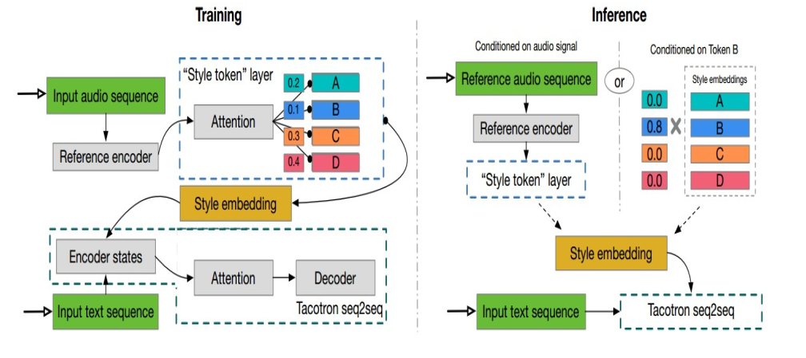

# Global style token (style change)



_Tacotron 2 with Global Style Tokens combines a reference encoder to the Tacotron 2
model. The reference encoder uses as input a spectrogram which is interpreted as the
style that the model should get to match. The reference encoder is similar to the text
encoder. It first goes through a stack of convolutional layers compiled by a recurrent
GRU network. It takes the last state and treats that as the query vector to an attention
mechanism. The attention mechanism is equal to the one used in the Transformer
implementation_

```
class GST(nn.Module):
    def __init__(self, hp):
        super().__init__()
        self.encoder = ReferenceEncoder(hp)
        self.stl = STL(hp)``

    def forward(self, inputs):
        enc_out = self.encoder(inputs)
        style_embed = self.stl(enc_out)

        return style_embed`