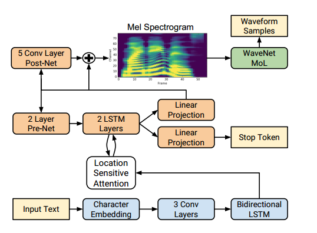
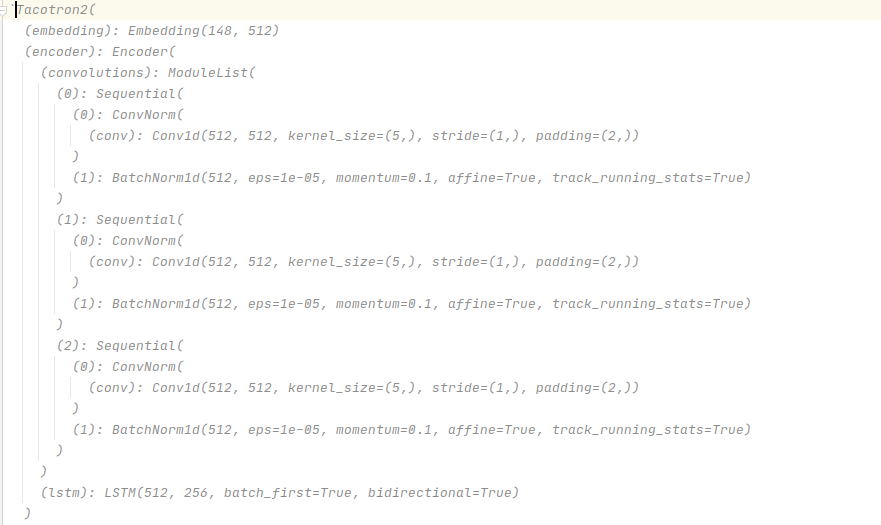
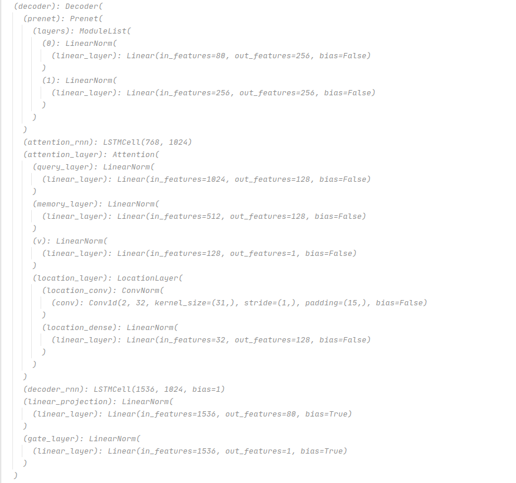
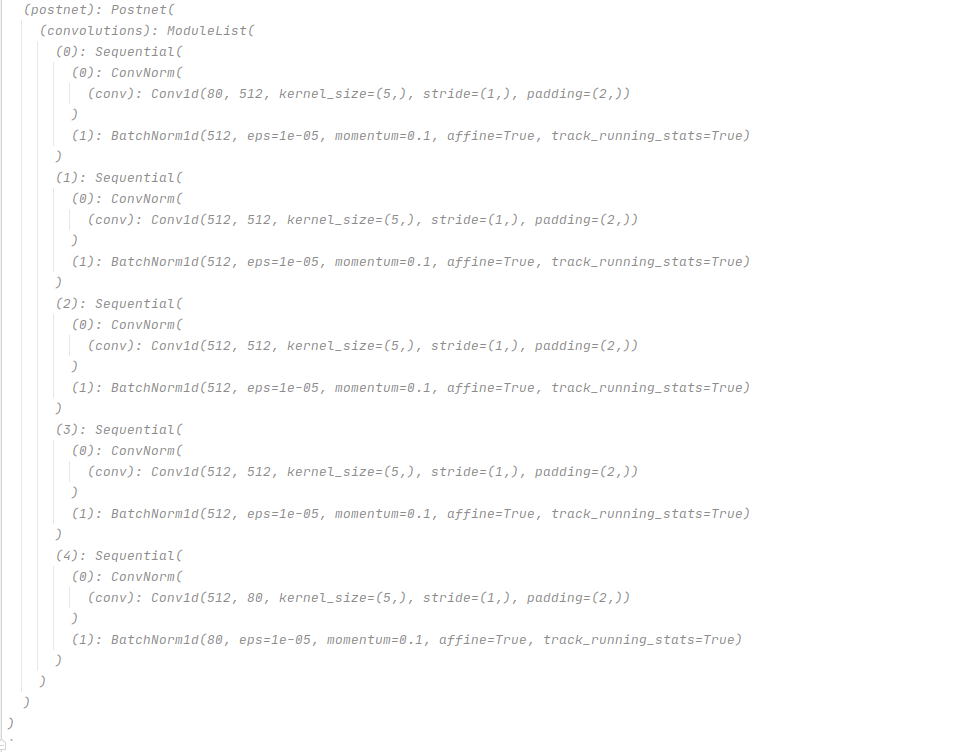

# Text-To-Speech
Tacotron2 + WaveGLow based Text to speech

**Tacotron2 model architecture**

**Encoder part of Tacotron2 model**

**Decoder with location sesitive attention**

**Enhance mel-spectrogram with postnet**

 
 
     def get_mel_text_pair(self, audiopath_and_text):
        # separate filename and text
        audiopath, text = audiopath_and_text[0], audiopath_and_text[1]
        text = self.get_text(text)
        mel = self.get_mel(audiopath)
        return (text, mel)

    def get_mel(self, filename):
        if not self.load_mel_from_disk:
            audio, sampling_rate = load_wav_to_torch(filename)
            if sampling_rate != self.stft.sampling_rate:
                raise ValueError("{} {} SR doesn't match target {} SR".format(
                    sampling_rate, self.stft.sampling_rate))
            audio_norm = audio / self.max_wav_value
            audio_norm = audio_norm.unsqueeze(0)
            audio_norm = torch.autograd.Variable(audio_norm, requires_grad=False)
            melspec = self.stft.mel_spectrogram(audio_norm)
            melspec = torch.squeeze(melspec, 0)
        else:
            melspec = torch.from_numpy(np.load(filename))
            assert melspec.size(0) == self.stft.n_mel_channels, (
                'Mel dimension mismatch: given {}, expected {}'.format(
                    melspec.size(0), self.stft.n_mel_channels))

        return melspec

    def get_text(self, text):
        text_norm = torch.IntTensor(text_to_sequence(text, self.text_cleaners))
        return text_norm

**We first get speech dataset with annotated text file after we load the text, audio mel spectorgram in data loader**

**After in tacotron2 architecture, Encoder will extract the text data. after the decoder extract the feature of the mel spectogram with attention, and mapping theme. in this way the model learn the text to speech knowledge**

**Finnaly another CNN module enhance the decode output with help of postnet(CNN)**

