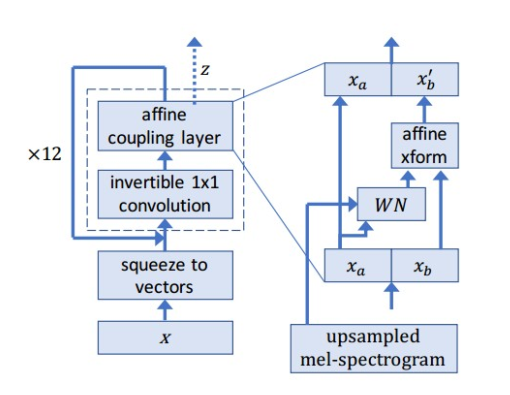
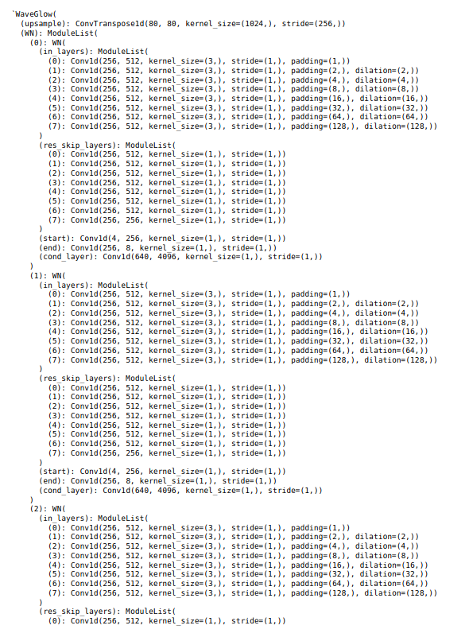

# WaveGlow

_The WaveGlow network has 12 coupling layers and 12 invertible 1x1 convolutions.
The coupling layer networks(WN) each have 8 layers of dilated convolutions, with
512 channels used as residual connections and 256 channels in the skip connections. It
has output 2 of the channels after every 4 coupling layers_

**Wavenet has 12 convolution-1D dilation layers (affine coupling layers)**

        for i in range(n_layers):

            dilation = 2 ** i

            padding = int((kernel_size * dilation - dilation) / 2)

            in_layer = torch.nn.Conv1d(n_channels, 2 * n_channels, kernel_size,
                                       dilation=dilation, padding=padding)

            in_layer = torch.nn.utils.weight_norm(in_layer, name='weight')

            self.in_layers.append(in_layer)

            # last one is not necessary
            if i < n_layers - 1:
                res_skip_channels = 2 * n_channels
            else:
                res_skip_channels = n_channels
            res_skip_layer = torch.nn.Conv1d(n_channels, res_skip_channels, 1)
            res_skip_layer = torch.nn.utils.weight_norm(res_skip_layer, name='weight')
            self.res_skip_layers.append(res_skip_layer)
            
 

**Invertible 1-1 convolution**

    def __init__(self, c):
        super(Invertible1x1Conv, self).__init__()

        self.conv = torch.nn.Conv1d(c, c, kernel_size=1, stride=1, padding=0,
                                    bias=False)

        # Sample a random orthonormal matrix to initialize weights
        W = torch.qr(torch.FloatTensor(c, c).normal_())[0]

        # Ensure determinant is 1.0 not -1.0
        if torch.det(W) < 0:
            W[:, 0] = -1 * W[:, 0]
        W = W.view(c, c, 1)

        self.conv.weight.data = W

    def forward(self, z, reverse=False):
        # shape
        batch_size, group_size, n_of_groups = z.size()

        W = self.conv.weight.squeeze()

        if reverse:
            if not hasattr(self, 'W_inverse'):
                # Reverse computation
                W_inverse = W.float().inverse()
                W_inverse = Variable(W_inverse[..., None])
                if z.type() == 'torch.cuda.HalfTensor':
                    W_inverse = W_inverse.half()
                self.W_inverse = W_inverse
            z = F.conv1d(z, self.W_inverse, bias=None, stride=1, padding=0)
            return z

        else:
            # Forward computation
            log_det_W = batch_size * n_of_groups * torch.logdet(W)
            z = self.conv(z)
            return z, log_det_W

**Finally the core work done in main module**

    def forward(self, forward_input):
        """
        forward_input[0] = mel_spectrogram:  batch x n_mel_channels x frames
        forward_input[1] = audio: batch x time
        """
        spect, audio = forward_input

        #  Upsample spectrogram to size of audio
        spect = self.upsample(spect)
        assert (spect.size(2) >= audio.size(1))
        if spect.size(2) > audio.size(1):
            spect = spect[:, :, :audio.size(1)]

        spect = spect.unfold(2, self.n_group, self.n_group).permute(0, 2, 1, 3)
        spect = spect.contiguous().view(spect.size(0), spect.size(1), -1).permute(0, 2, 1)

        audio = audio.unfold(1, self.n_group, self.n_group).permute(0, 2, 1)
        output_audio = []
        log_s_list = []
        log_det_W_list = []

        for k in range(self.n_flows):
            if k % self.n_early_every == 0 and k > 0:
                output_audio.append(audio[:, :self.n_early_size, :])
                audio = audio[:, self.n_early_size:, :]

            audio, log_det_W = self.convinv[k](audio)
            log_det_W_list.append(log_det_W)

            n_half = int(audio.size(1) / 2)
            audio_0 = audio[:, :n_half, :]
            audio_1 = audio[:, n_half:, :]

            output = self.WN[k]((audio_0, spect))
            log_s = output[:, n_half:, :]
            b = output[:, :n_half, :]
            audio_1 = torch.exp(log_s) * audio_1 + b
            log_s_list.append(log_s)

            audio = torch.cat([audio_0, audio_1], 1)

        output_audio.append(audio)
        return torch.cat(output_audio, 1), log_s_list, log_det_W_list

**Sample layer architecture**

